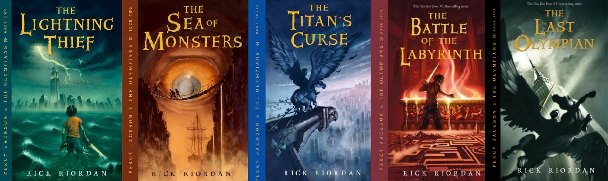

# pjocolours
An R package for color palettes inspired by the original book covers of Percy Jackson and the Olympian by Rick Riordan.



*Note*: I do not own any aspect of Percy Jackson and the Olympians, all titles and ideas are the original content of author Rick Riordan.  

## Installation

You can install the released version of nationalparkcolors from GitHub with

```r
# install.packages("devtools")
devtools::install_github("MaiaPelletier/pjocolours")
```

## Introduction  

As of right now, there are 5 palettes available (for the 5 original book covers), each with 5 colours.
These palettes were created with the help of [coolors.co](https://coolors.co/).

All the palettes are stored in `pjo_palettes`:

```r
library(pjocolors)
names(pjo_palettes)

# > [1] "LightningThief"    "SeaOfMonsters"     "TitansCurse"      
# > [4] "BatOfTheLabyrinth" "LastOlympian"   
```