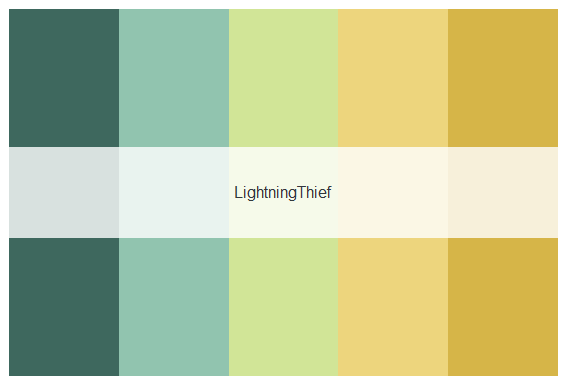
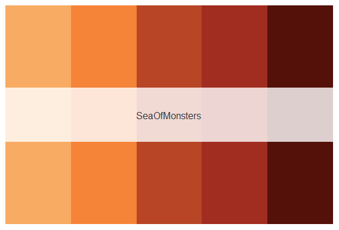
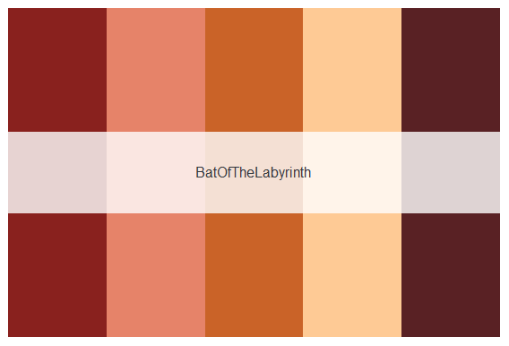
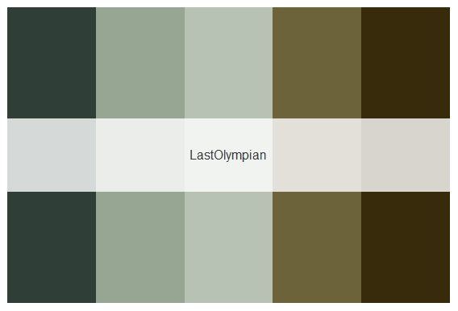

pjocolors
================

  - [Installation](#installation)
  - [Introduction](#introduction)
  - [Palette Overview](#palette-overview)
  - [Examples](#examples)

An R package for color palettes inspired by the original book covers of
*Percy Jackson and the Olympians* by Rick Riordan.


**Disclaimer: I do not own any aspect of Percy Jackson and the
Olympians, all titles and ideas are the original content of author Rick
Riordan.**

## Installation

You can install the released version of pjocolors from GitHub with

    # install.packages("devtools")
    devtools::install_github("MaiaPelletier/pjocolours")

## Introduction

As of right now, there are 6 palettes available (based on the 5 original
book covers), each with 5 colours. These palettes were created with the
help of [coolors.co](https://coolors.co/).

All the palettes are stored in `pjo_palettes`:

``` r
library(pjocolors)
names(pjo_palettes)
```

    ## [1] "LightningThief"    "SeaOfMonsters"     "TitansCurse"      
    ## [4] "BatOfTheLabyrinth" "LastOlympian"      "LastOlympian2"

## Palette Overview



## Examples

Using library checkout data from the [City of Seattle Open Data
Portal](https://data.seattle.gov/Community/Checkouts-by-Title/tmmm-ytt6/data),
I created some plots to illustrate how to use `pjocolors`.

### Discrete Scales

    # Make plots
    p1 <- 
      pjo_checkouts %>% 
      ggplot(aes(CheckoutYear, checkouts, color = MaterialType)) +
      geom_line(size = 1) +
      labs(x = 'Year', y = 'Number of checkouts') +
      guides(colour = guide_legend(""))
    
    p2 <- 
      pjo_checkouts %>%
      ggplot(aes(reorder(MaterialType, -checkouts), checkouts)) +
      geom_col(aes(fill = MaterialType), show.legend = FALSE, 
               alpha = 0.8, width = 0.65) +
      labs(x = NULL, y = 'Number of checkouts')
    
    # Apply pjocolors (default = LightningThief)
    p1 + scale_color_pjo()
    
    # Apply pjocolors (BatOfTheLabyrinth)
    p2 + scale_fill_pjo(palette = 'BatOfTheLabyrinth')


### Continuous scales

    # Make plot
    p3 <- 
      pjo_checkouts %>%
      ggplot(aes(CheckoutMonth, checkouts, group = CheckoutMonth)) +
      geom_point(aes(color = checkouts), alpha = 0.65) +
      labs(x = NULL, y = 'Checkouts') +
      scale_x_continuous(labels = month.abb, breaks = 1:12) +
      guides(color = guide_colorbar(title = 'Number of checkouts'))
      
    # Apply pjocolors (SeaOfMonsters)
    p3 + scale_color_pjo(palette = 'SeaOfMonsters', discrete = FALSE)


